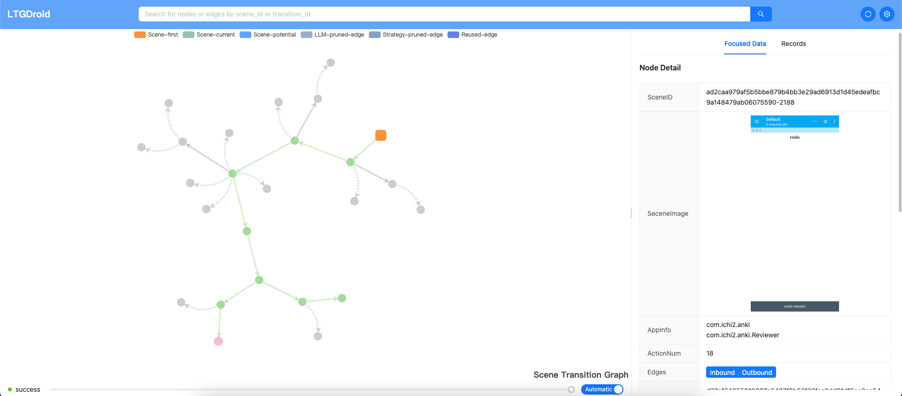

# LTGDroid

Reproducing user-reported bugs quickly and accurately is essential for ensuring the quality of mobile apps and improving user satisfaction. However, manual reproduction is often time-consuming and complex.

**LTGDroid** is an automated approach designed to explore Android apps and identify the correct sequence of UI actions needed to reproduce a bug, given only a complete bug report. While Large Language Models (LLMs) have shown strong abilities in understanding textual and visual semantics, existing LLM-based approaches struggle to follow detailed bug reproduction steps and adapt to new information, due to difficulties in predicting the visual effects of UI components.

LTGDroid addresses this challenge by executing all possible UI actions on the current screen, recording their visual effects, and using these cues to guide the LLM in selecting actions that are likely to reproduce the bug.

We evaluated LTGDroid on a benchmark of 75 bug reports from 45 popular Android apps. It achieves a reproduction success rate of **86.67%**, outperforming state-of-the-art baselines by **47.73%** and **550.00%**, while requiring an average of **27.10 UI actions** per bug.

## Screenshot



## Directory Structure

```
LTGDroid
├── main.py          Entry point of LTGDroid; accepts tool parameters
├── visualize.py     Visualization tool to view LTGDroid’s execution process and results
├── env.json         LLM-related configuration file
├── bugs             Benchmark bug reports (75 JSON files)
│   ├── xxx.json     Details of a single bug report
│   └── ...
└── working          LTGDroid working directory
    └── apks         APK files of the 75 evaluated apps
...
```

## Environment
- Mac mini M4, (10-core CPU) and 32 GB of memory
- Android emulators
    - Android 9.0 ARM system image
    - 4 CPU cores
    - 4 GB of memory
    - hardware acceleration enabled
    - 1080 × 2400, density 420 (Medium Phone preset)
- Python 3.13

## Installation

### Clone repository

```bash
git clone https://github.com/N3onFlux/LTGDroid.git
cd LTGDroid
```

### Install the required Python packages by [Poetry](https://python-poetry.org/):

```bash
poetry install
```

##  Usage

### Provide LLM API keys in `env.json` file

```json lines
{
  "llm_service": "openai",
  "openai": {
    "api_key": "sk-xxxxxxxxxxxxxxxxxxxxxxxxxxxxxxxxxxxxxxxxxxxxxxxx",
    "base_url": "https://api.openai.com/v1/",
    "text_model": "gpt-4.1",
    "image_model": "gpt-4.1",
    "format_model": "gpt-4o-mini"
  },
}
```

### Ensure Proper Configuration of ADB and Emulator Commands

Make sure that both `adb` and `emulator` commands are available and properly configured in your system's environment PATH. These tools are essential for interacting with the Android Debug Bridge (ADB) and controlling the Android Emulator, respectively.

### Run LTGDroid on a target bug report

```bash
python main.py -avd_name Avd_0 -avd_port 5554 -bug_name Anki-Android#5753 -apk_name Anki-Android_v2.9.1.apk -max_transition 100 -max_step 30 -llm_first_branch_limit 6 -llm_second_branch_limit 3
```

Here,

* `-avd_name`: Name of the AVD emulator instance.
* `-avd_port`: Port number of the AVD emulator.
* `-bug_name`: Name of the bug report JSON file (from `./bugs/`).
* `-apk_name`: Name of the target APK file. **Must match the `"apk_name"` field defined in the corresponding `bug_name` JSON file.** The APK itself should be placed in `./working/apks/`.
* `-max_transition`: Maximum number of UI state transitions allowed, equivalent to the number of UI actions.
* `-max_step`: Maximum number of iteration rounds.
* `-llm_first_branch_limit`: Maximum number of candidate UI actions to retain during action filtering (corresponding to `threshold_a`).
* `-llm_second_branch_limit`: Maximum number of exploration paths retained by the Path Evaluator after each iteration (corresponding to `threshold_k`).


### Start LTGDroid visualization tool

To start the LTGDroid visualization tool, run the following command:

```bash
python visualize.py
```

Then, open your browser and navigate to:
[http://127.0.0.1:13126](http://127.0.0.1:13126)

In the web interface, go to the config's `resultDirectory` field and enter the absolute path of the directory containing the results you want to monitor. For example:
`D:\LTGDroid\working\result\com.ichi2.anki\2025-08-30_16-39-10`

Once you have entered the path, you will be able to view the running results, as shown in the screenshot.
